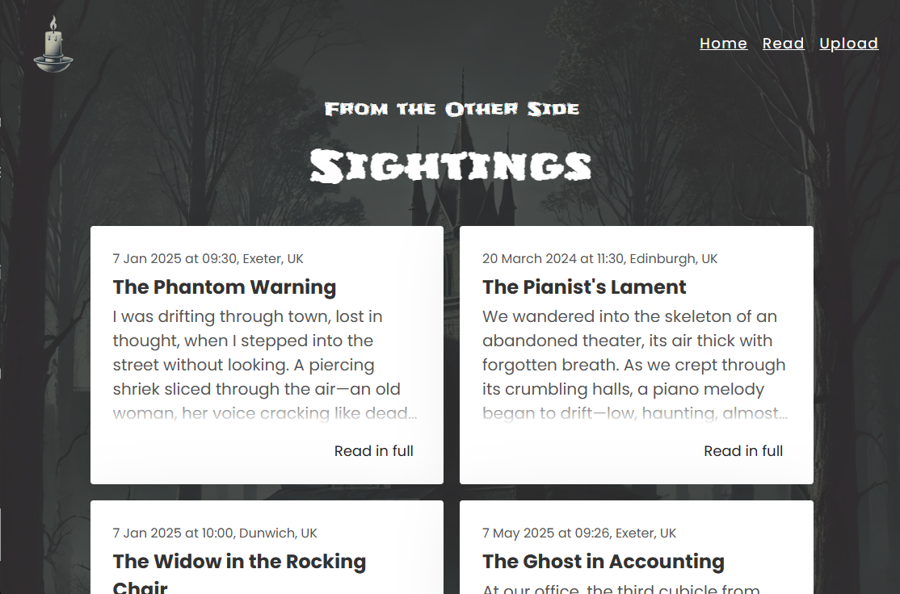
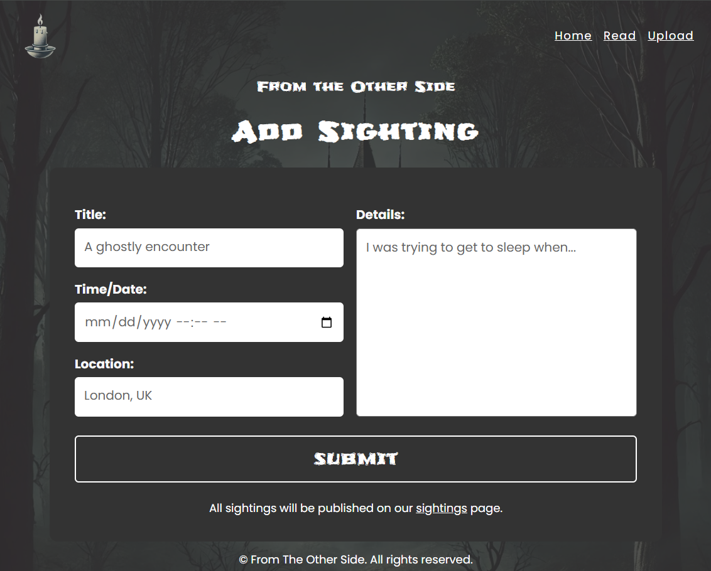

# 👻 From The Other Side

A full-stack Node.js web application for reading and sharing ghost sightings. Built using core Node.js modules, this project allows users to explore mysterious paranormal experiences and upload their own spooky stories.

> 🧛 Share your tale. 👀 Read others'. 👻 From The Other Side.

---

## 🌐 Live Demo

[🔮 View the Demo ](https://sea-lion-app-agspt.ondigitalocean.app/)

---

## 📁 Project Structure

```
from-the-other-side/
│
├── Data/
│   └── data.json            
│
├── handlers/
│   └── routeHandlers.js         
│
├── public/                       # Static frontend files
│   ├── images/                 
│   ├── 404.html             
│   ├── index.html           
│   ├── index.css          
│   ├── index.js              
│   ├── sighting.html             
│   ├── upload-sighting.html      
│   └── upload-sighting.js        
│
├── utils/
│   ├── addNewSighting.js         
│   ├── getContentType.js         
│   ├── getData.js                
│   ├── parseJSONBody.js          
│   ├── sanitizeInput.js          
│   ├── sendResponse.js           
│   └── serveStatic.js            
│
├── server.js                     # Main entry point for HTTP server
├── package.json
└── package-lock.json
```

---

## 🚀 Features

- 📖 View ghost sightings in a clean, responsive UI.
- ✍️ Upload your own sighting with title, location, time, and description.
- 🔐 Input sanitization to prevent XSS attacks.
- 💡 Accessible and semantic HTML with proper ARIA roles.
- 🌈 JSON-based storage, no database required.

---

## ⚙️ How It Works

### API Routes

- `GET /api`  
  Returns all stored ghost sightings from `data/data.json`.

- `POST /api`  
  Accepts JSON body, sanitizes input, appends to `data.json`, and returns the new sighting.

### Static Files

- `/` – Displays all ghost sightings (uses `index.html`)
- `/upload-sighting.html` – Upload form for new ghost encounters

---

## 🧑‍💻 Technologies Used

- **Backend:** Node.js (no framework)
- **Frontend:** Vanilla JS, HTML, CSS
- **Data Storage:** JSON file (`data/data.json`)
- **Security:** [`sanitize-html`](https://www.npmjs.com/package/sanitize-html) to clean inputs

---

## 🛠 Setup Instructions

### Prerequisites

- [Node.js](https://nodejs.org/) installed

### Install Dependencies

```bash
npm install
```

### Start Server

```bash
npm start
```

The app will be running at [http://localhost:8080](http://localhost:8080)

---

## 🔒 Security

- Inputs are sanitized using `sanitize-html` to strip any malicious scripts.
- JSON parsing is handled safely with error catching.

---

## 📬 Example Sighting Format

```json
{
  "location": "Abandoned Hospital",
  "timeStamp": "23 July 2025, 03:33",
  "text": "I saw a figure in the hallway, but when I turned, it vanished...",
  "title": "Ghost in the Corridor"
}
```

---

## 📸 Screenshots

### Home Page


### Read Page (Sighting Feed)



### Upload Form



---

## 🧠 Insights

This project demonstrates:

- Building a Node.js server from scratch
- Managing file-based storage
- Serving static assets manually
- Handling API routes without Express
- Clean modular architecture

---

## ✍️ Author

Developed by [Code-X-Anuj](https://github.com/codeXanu)  
Fullstack Developer
Feel free to open issues or PRs!

---

## 📄 License

This project is licensed under the **ISC License**.  
Feel free to use, modify, or share!

---

## 🙏 Acknowledgements

- [sanitize-html](https://www.npmjs.com/package/sanitize-html) for keeping user input safe

---
